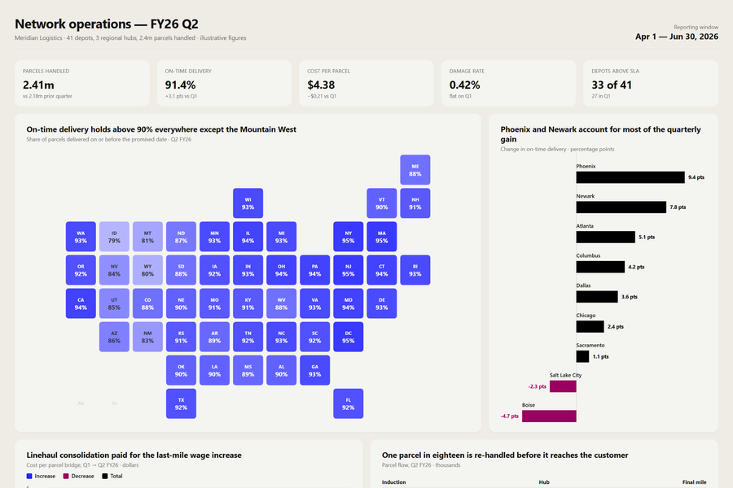
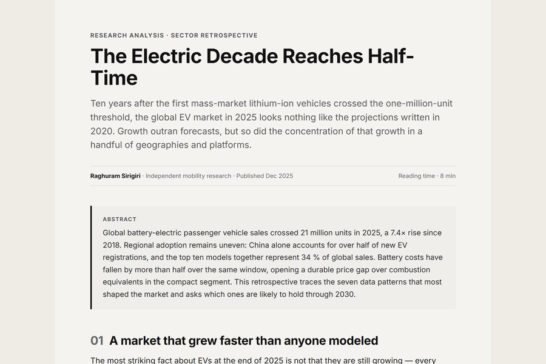
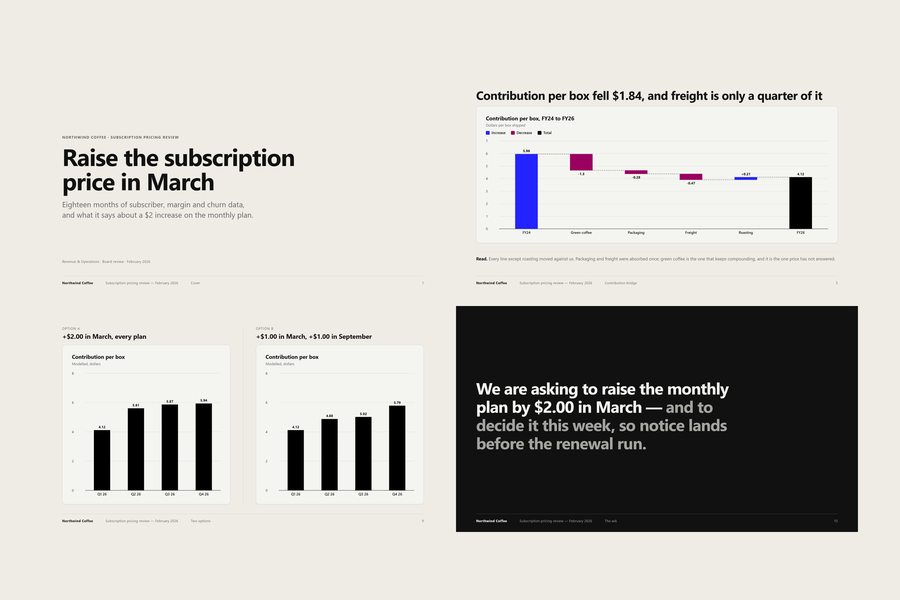
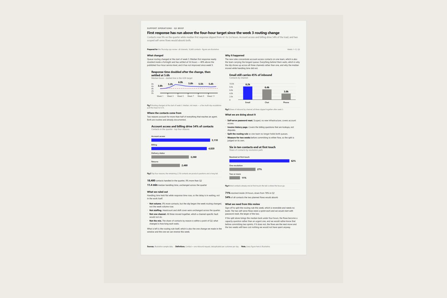
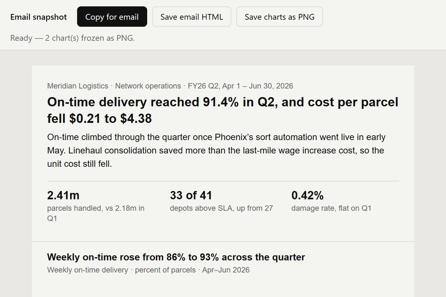
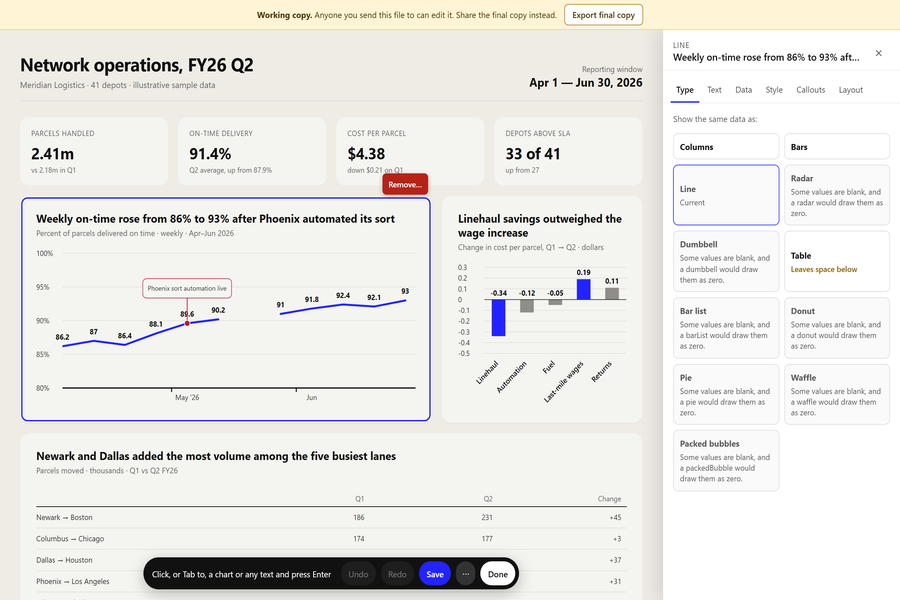
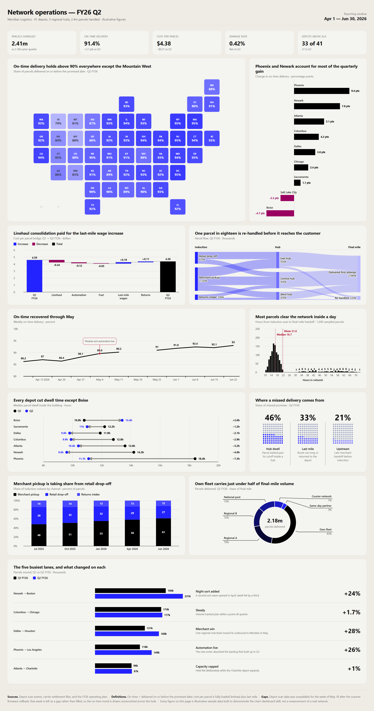
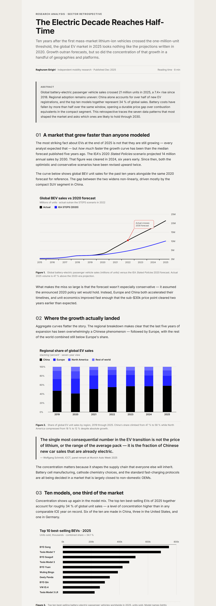
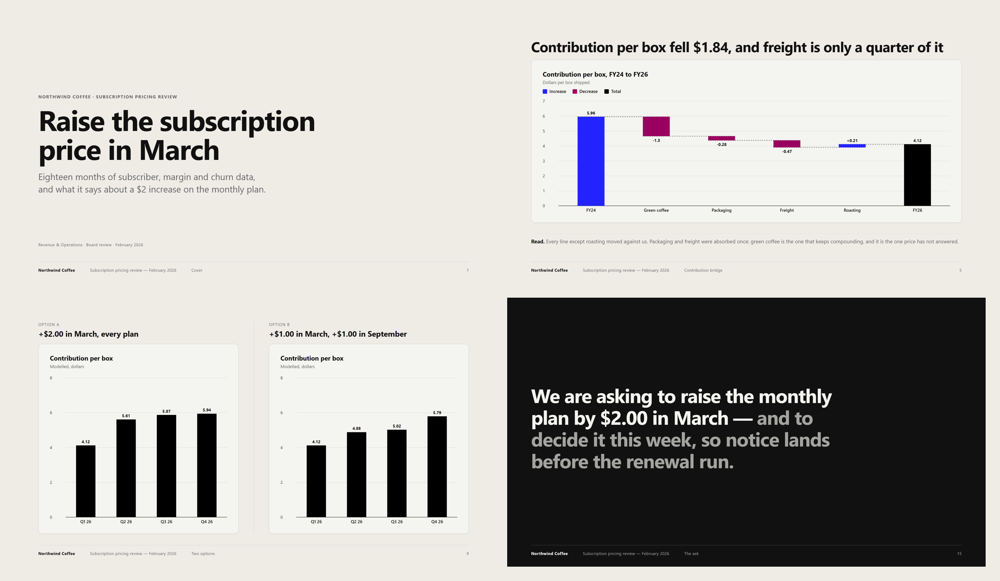

# chart-dashboard — Claude Skill for Generating HTML Dashboards and Data Reports

[](LICENSE)
[](https://docs.claude.com/en/docs/agents-and-tools/agent-skills/overview)
[](https://docs.claude.com/en/docs/claude-code/plugins)
[](#what-are-the-dependencies)
[](#does-it-work-offline)

**chart-dashboard is a free, open-source Claude Agent Skill that turns raw data into a
finished HTML dashboard, illustrated report, slide deck, printable one-pager or
email-ready chart snapshot in a single prompt.** Give Claude a
table, a CSV, pasted numbers, or meeting notes, and it returns one self-contained
HTML file with interactive SVG charts — no CDN, no npm install, no build step, and
no API keys.

Works in **Claude Code**, **claude.ai**, **Claude Desktop**, and the **Claude API** —
and, because it's vendor-neutral Markdown plus a dependency-free JS library, also in
**Gemini CLI**, **OpenAI Codex**, **GitHub Copilot**, **Cursor**, and any other agent
that can read a file.

📖 **[Full documentation and FAQ →](https://raghuramsirigiri.github.io/raghuram-skills/)**

<table>
<tr>
<td width="33%" valign="top"><a href="#dashboard"></a><br><b><a href="#dashboard">Dashboard</a></b><br><sub>One panel per finding</sub></td>
<td width="33%" valign="top"><a href="#report"></a><br><b><a href="#report">Report</a></b><br><sub>An argument with evidence</sub></td>
<td width="33%" valign="top"><a href="#slide-deck"></a><br><b><a href="#slide-deck">Slide deck</a></b><br><sub>One claim per slide</sub></td>
</tr>
<tr>
<td width="33%" valign="top"><a href="#one-pager"></a><br><b><a href="#one-pager">One-pager</a></b><br><sub>One printed sheet, in columns</sub></td>
<td width="33%" valign="top"><a href="#email-snapshot"></a><br><b><a href="#email-snapshot">Email snapshot</a></b><br><sub>Pastes into Gmail and Outlook</sub></td>
<td width="33%" valign="top"><a href="#editable-pages"></a><br><b><a href="#editable-pages">Editable pages</a></b><br><sub>Change it without a rerun</sub></td>
</tr>
</table>

<sub>Every page above was built by the skill from a single prompt. The finished files are in [`examples/`](examples/): each is one HTML file that opens offline.</sub>

---

## Contents

- [What is chart-dashboard?](#what-is-chart-dashboard)
- [Why use it instead of a charting library?](#why-use-it-instead-of-a-charting-library)
- [Installation](#installation)
- [How do I use it?](#how-do-i-use-it)
- [What can it build?](#what-can-it-build)
- [Output formats](#output-formats)
  - [Dashboard](#dashboard) · [Report](#report) · [Slide deck](#slide-deck) · [One-pager](#one-pager) · [Email snapshot](#email-snapshot) · [Editable pages](#editable-pages)
- [Which chart types are supported?](#which-chart-types-are-supported)
- [Theming and brand colors](#theming-and-brand-colors)
- [FAQ](#faq)
- [What's in the box](#whats-in-the-box)
- [Contributing](#contributing)
- [License](#license)

---

## What is chart-dashboard?

chart-dashboard is a [Claude Agent Skill](https://docs.claude.com/en/docs/agents-and-tools/agent-skills/overview)
— a packaged set of instructions and assets that teaches Claude a specific job. This
one teaches Claude how to design and build data dashboards: which chart type fits
which data shape, how to lay out a bento grid, and how to render it all with a
bundled zero-dependency SVG chart library.

You describe your data in plain language. Claude picks the charts, writes the HTML,
and hands you a file you can double-click, commit to a repo, email to a client, or
drop behind a login. Nothing phones home.

## Why use it instead of a charting library?

Chart libraries render what you tell them to render. This skill decides *what to
render* — which is the part that takes design judgment.

| | chart-dashboard | Chart.js / Plotly / Recharts | Screenshot of a BI tool |
|:--|:--|:--|:--|
| Input | Plain-language data | Hand-written config | Manual dashboard building |
| Picks the chart type for you | ✅ | ❌ | ❌ |
| Runtime dependencies | None | npm / CDN | SaaS account |
| Works offline | ✅ | Usually not (CDN) | ❌ |
| Output | One portable HTML file | Your app | PNG |
| Interactive tooltips and legends | ✅ | ✅ | ❌ |
| Cost | Free, MIT | Free | Usually paid |

It also refuses the common mistakes: pie charts for time series, five lines on one
axis, dual axes, truncated bar baselines, and donuts with fifteen wedges.

Four judgment calls it makes that a library can't:

- **The layout comes from the analysis.** The grid is derived from the shape of
  the findings — one dominant trend opens differently from a head-to-head
  comparison, a ranking, or six co-equal measures — and a wide hero panel is only
  given to a finding that actually leads.
- **Titles state the finding.** "Throughput fell 12% the week of the WMS cutover",
  not "Weekly throughput by site" — with the line held at quantified claims the
  chart proves, not adjectives and verdicts.
- **The chart shows the finding.** When a title names specific categories or a
  specific series, those take the accent and everything else is muted, so the
  picture agrees with the sentence above it.
- **Measured, planned, and projected look different.** Forecasts are dashed or
  hatched rather than spending a palette colour, so a projection is never drawn in
  the same stroke as a measurement.

## Installation

### Claude Code — plugin install (recommended)

```bash
/plugin marketplace add raghuramsirigiri/raghuram-skills
```

```bash
/plugin install chart-dashboard@raghuram-skills
```

The `raghuram-skills` marketplace holds **independent plugins** — installing one never
pulls in the others:

| Plugin | What it does |
| --- | --- |
| `chart-dashboard` | This one. Data → a self-contained HTML dashboard, report, deck, one-pager or email snapshot. |
| `decisions-only` | A meeting transcript → the decisions and commitments, and nothing else. |
| `whats-changed` | This period's numbers against last period's → what moved, by how much, and the few lines that explain the total. |
| `sanity-check` | One spreadsheet, deck or PDF → the mistakes that would embarrass you, ranked into what blocks sending. |
| `exec-brief` | A long thread or document → one bottom-line sentence, at most three points, and one ask. |

Install any of them the same way — `/plugin install <name>@raghuram-skills`.

### Claude Code — manual install

```bash
git clone https://github.com/raghuramsirigiri/raghuram-skills.git
```

```bash
cp -r raghuram-skills/plugins/chart-dashboard/skills/chart-dashboard ~/.claude/skills/
```

To scope the skill to one project instead of every project, copy it into
`.claude/skills/` in that project's root.

### claude.ai, Claude Desktop, and the API

Zip the skill folder, then upload it under **Settings → Capabilities → Skills**:

```bash
cd raghuram-skills/plugins/chart-dashboard/skills && zip -r chart-dashboard.zip chart-dashboard
```

### Gemini CLI, OpenAI Codex, GitHub Copilot, Cursor, and other AI tools

The skill is plain Markdown plus a dependency-free JavaScript library — nothing
in it is Claude-specific. Any agent that can read files and write an HTML file
can run it, and this repo ships working instruction files for the three big
conventions so you can copy one as a starting point.

**1. Copy the skill into your project:**

```bash
git clone https://github.com/raghuramsirigiri/raghuram-skills.git
```

```bash
cp -r raghuram-skills/plugins/chart-dashboard/skills/chart-dashboard ./.agent-skills/chart-dashboard
```

**2. Point your tool at it** by adding this to whichever instruction file your
tool reads:

```markdown
## Dashboards, reports, decks and one-pagers
When asked to build a dashboard, analytics page, data report, slide deck or
one-page printable brief,
follow `.agent-skills/chart-dashboard/SKILL.md`.
```

| Tool | Where to put that block |
|:--|:--|
| OpenAI Codex, Cursor, Zed, Aider, Jules, opencode | `AGENTS.md` in the repo root |
| Gemini CLI, Gemini Code Assist | `GEMINI.md` in the repo root |
| GitHub Copilot (VS Code, JetBrains, CLI) | `.github/copilot-instructions.md` |
| Windsurf | `.windsurf/rules/chart-dashboard.md` |
| Cline / Roo Code | `.clinerules/chart-dashboard.md` |
| Claude Code, Claude Desktop, claude.ai | Install as a skill (above), or `CLAUDE.md` |
| Anything else | Paste `SKILL.md` into your system prompt |

Copyable starting points in this repo: [`AGENTS.md`](AGENTS.md),
[`GEMINI.md`](GEMINI.md), and
[`.github/copilot-instructions.md`](.github/copilot-instructions.md). Agents that
read the portable-skills manifest can also pick the skill up from
[`.agents/skills.json`](.agents/skills.json), which points at `skills/` and needs
no instruction file at all.

Tool config conventions change fast — if a path here looks stale, check your
tool's current docs; the block itself is the only thing that matters, and any file
your agent reads at startup will do.

**Browser verification degrades gracefully.** Where an agent has browser tooling
it screenshots the result and reads the console; where it doesn't, `SKILL.md`
carries a Node one-liner that checks every grid panel has a matching chart call.
No agent-specific tool is required either way.

## How do I use it?

Ask for a dashboard in plain language — the skill triggers on its own, no slash
command required.

> Build me a dashboard from this — Q1 revenue 412k, Q2 438k, Q3 451k, Q4 602k.
> Channels: direct 38%, paid search 24%, organic 20%, email 11%, other 7%.
> The Q4 spike was the November promo.

> Here's our support CSV. Make an analytics page: ticket volume over time,
> resolution time by team, and where the backlog is concentrated.

> Write up a retrospective on our 2025 uptime with charts. Data's in incidents.md.

> Turn this spreadsheet into a client-ready report with our brand colors.

> Make a deck for Thursday's board meeting out of these pricing numbers — one
> claim per slide, and end on the ask.

It reads markdown tables, CSV, TSV, JSON, pasted spreadsheet cells, and prose with
numbers buried in it. If you give it a topic with no numbers, it tells you so and
labels the figures as illustrative rather than passing invented data off as real
measurements.

## What can it build?

Common uses:

- **Executive KPI dashboards**: quarterly revenue, pipeline, headcount
- **Marketing and web analytics reports**: traffic, channel mix, conversion funnels
- **Sales performance dashboards**: quota attainment, win rates, regional splits
- **Product usage and engagement dashboards**: DAU/MAU, retention, feature adoption
- **Financial summaries**: budget vs. actual, burn rate, unit economics
- **Survey and research write-ups**: distributions, cross-tabs, narrative report
- **Incident and uptime retrospectives**: timelines, MTTR, root-cause breakdowns
- **Portfolio and investment reviews**: allocation donuts, performance over time
- **Board decks and pitch material**: one claim per slide, ending on the ask
- **Weekly updates by email**: the week's two or three findings in the message body
- **Client-facing agency deliverables**: branded, self-contained, emailable

## Output formats

The skill picks the format from how you phrase the request. Every format is one
self-contained HTML file that opens offline.

| Format | What it's for | Ask for it with | Example |
|:--|:--|:--|:--|
| [Dashboard](#dashboard) | Monitoring: one panel per finding, no prose | *(the default)* "dashboard", "analytics page", "KPI view" | [`logistics-network-dashboard/`](examples/logistics-network-dashboard/), [`q4-ecommerce/`](examples/q4-ecommerce/) |
| [Report](#report) | An argument with evidence | "write up", "retrospective", "analysis" | [`ev-retrospective/`](examples/ev-retrospective/) |
| [Slide deck](#slide-deck) | An argument someone presents | "presentation", "slides", "deck" | [`coffee-pricing-deck/`](examples/coffee-pricing-deck/) |
| [One-pager](#one-pager) | A report on one printed sheet | "print it", "one page", "a handout", "for the board pack" | [`support-operations-brief/`](examples/support-operations-brief/) |
| [Email snapshot](#email-snapshot) | One to three findings in an email body | "paste it into the weekly update", "Outlook", "Gmail" | [`logistics-network-email/`](examples/logistics-network-email/) |
| [Editable pages](#editable-pages) | Any of the above except the one-pager, with an in-page editor | "make it editable", "so I can change the numbers" | [screenshot](examples/editable-editor.png) |

### Dashboard

A bento grid with one panel per finding and no prose. This is the default when
you hand over metrics with no argument attached. The grid comes from the shape of
the analysis, and a wide hero panel goes only to a finding that leads.

**Example: [`logistics-network-dashboard/`](examples/logistics-network-dashboard/).**
A quarterly operations dashboard in one standalone file (770 KB, library inlined):
a geofacet tile map of on-time delivery by US state, a cost-per-parcel waterfall
bridge, a Sankey of parcel flow through the hubs, a histogram of time in network,
waffle grids, a dumbbell of hub dwell before and after, a 100% stacked column of
channel mix, a donut, and a bar insight table of the five busiest lanes. A missing
week of scan data is left as a visible gap rather than filled in.

[](examples/logistics-network-dashboard/)

A second dashboard, [`q4-ecommerce/`](examples/q4-ecommerce/)
([screenshot](examples/q4-ecommerce/screenshot.png)), is a 20-panel grid: a revenue
trend with annotated spikes, channel and device mix, category comparisons, funnel
and cohort views, and a full-width composition panel.

### Report

Narrative sections with figures and captions, set in a paper column. Captions say
what the figure means, not what it shows.

**Example: [`ev-retrospective/`](examples/ev-retrospective/).** A sector
retrospective with an abstract, numbered sections, figures with interpretive
captions, pull quotes and source notes.

[](examples/ev-retrospective/)

### Slide deck

One claim per 16:9 slide. The skill always lays a fixed spine first (cover,
agenda, a divider for each section, a closing ask), then picks one of eighteen
layouts for each claim. Print it (Ctrl/Cmd+P, then Save as PDF) and it comes out
A4 landscape, one slide per sheet.

**Example: [`coffee-pricing-deck/`](examples/coffee-pricing-deck/).** A
sixteen-slide decision deck. Evidence slides use the split, full-bleed, KPI-strip,
compare, table, timeline, quote and stat layouts. Chart slides carry paragraphs
and bullet points beside the chart, and the table slide puts a trend line and
before/after bars in every row.

[](examples/coffee-pricing-deck/)

### One-pager

A report on a single sheet of paper, set in columns of headings, paragraphs, lists
and figures. The sheet is sized to the printable area that A4 and US Letter share,
so it prints as exactly one page on either with nothing to change in the print
dialog. Charts are sized to the column they sit in, so the page gets packed
instead of padded. It has no controls and nothing that only appears on hover,
because paper has no pointer.

**Example: [`support-operations-brief/`](examples/support-operations-brief/).** A
masthead with the finding and a two-sentence summary, then two packed columns: six
prose sections, four charts, a findings list, two pairs of statistics and a method
note.

[](examples/support-operations-brief/)

### Email snapshot

One to three findings in a 600px block that survives being pasted into Gmail or
Outlook. Gmail strips SVG and Outlook for Windows can't draw it, so every style is
inline, the titles are text, and each chart is frozen into a PNG with alt text
when the page opens. Click **Copy for email** and paste into a new message.

**Example: [`logistics-network-email/`](examples/logistics-network-email/).** The
logistics dashboard's Q2 data cut down for an email: a headline, three figures, a
weekly on-time line with a callout, a column of cost drivers, and the busiest lanes
as a plain email table.

[](examples/logistics-network-email/)

### Editable pages

Ask for an editable page and the dashboard, report, deck or email snapshot comes
with an **Edit page** button. It opens an in-page editor where you can change text
and numbers, switch a chart's type, restyle colours, and remove or move content,
then save the file without rerunning anything. An editable page ships as two files:

- `<name>.html` is the final copy. It has no editor, and it's the one to share.
- `<name> (working copy).html` is the editable copy, marked as a draft.

In an editable email snapshot every edit re-freezes the charts, so **Copy for
email** always copies the page as it now stands. A one-pager can't be made
editable: an edit could lengthen a title on a page with no scrollbar, and the
sheet would crop it without warning.


## Which chart types are supported?

| Family | Variants |
|:--|:--|
| Line | line, spline, step, datetime axis, logarithmic axis, zoomable |
| Dumbbell | two series over the same categories, joined per category — before/after, gap to target |
| Histogram | counts, percentage, and cumulative distributions |
| Waterfall | running total built from positive and negative steps |
| Sankey | flows between stages |
| Heatmap | a value per cell of two ordered dimensions (hour × weekday, cohort × week); a calendar heatmap of one value per day |
| Radar | several measures per item on shared spokes |
| Column & bar | grouped, stacked, 100% stacked, range, pyramid, 3D, population pyramid |
| Bar list | axis-free ranked bars, label above each bar, sortable, negative values |
| Bar insight table | per row: bars, an insight headline and description, and a large auto-computed change stat |
| Donut & pie | donut, full pie, semi-circle, variable radius, gradient, exploded slices |
| Scatter | scatter, linear regression trend line, labeled points |
| Bubble | bubble (area-scaled), packed bubble, clustered packed bubble |
| Tables | formatted table with sign/scale highlighting; report table mixing text, insight, KPI and small-chart columns |
| Waffle | dot-grid part-of-whole panels — headline stat, grid, label, description |
| Geofacet | one tile per region on a map-shaped grid — bar, heat, or gauge tiles |
| Panels | a compositor, not an engine: several charts under one shared title as a single exhibit |

Every chart is inline SVG with native tooltips, hover highlighting, and clickable
legends. Donut wedges explode on click; line charts zoom by drag. Charts animate in
on first draw (not under reduced motion), and every chart can be reached and walked
from the keyboard. No canvas, no framework.

## Theming and brand colors

Every visual token lives in a single `Charts.theme` object, derived from two
sources: `Charts.palette` (the neutral and series colour scale) and
`Charts.metrics` (type scale, strokes, spacing). Hand a palette to
`Charts.applyPalette` once, before the first chart call, and every chart on the
page re-skins — including the roles it is easy to forget by hand, like the
geofacet tile surface and the tooltip hairline:

```js
Charts.applyPalette({
  n0:  '#1a1a2e',   // canvas
  n0a: '#22223c',   // tile / panel surface
  n1:  '#2a2a4a',   // gridlines
  n8:  '#ffffff',   // titles and values
  nInverse: '#1a1a2e',   // text on light fills — dark, on a dark theme
  s1:  '#e94560', s2: '#0f3460', s3: '#533483'
});
```

`Charts.applyMetrics({ titleSize: 20 })` is the same contract for the non-colour
half, though the type scale and spacing are best left alone.

The default is a cream-and-ink print theme. In practice you don't write this
yourself — ask for "a dark dashboard" or "use our brand colors, #FF6B35 primary"
and Claude sets the tokens. The full list is in
[`references/charts/theme-tokens.md`](plugins/chart-dashboard/skills/chart-dashboard/references/charts/theme-tokens.md).

Two bundled scripts build that block for you, both running the same OKLCH recipe —
paper, a greyscale ink ramp, a seven-step series ramp, and separate `accent` /
`annotation` / `counter` roles, each checked for contrast:

```bash
# Point it at a brand's stylesheet or a saved page: harvests canvas, series hue,
# and any colour already reserved for a utility role
node plugins/chart-dashboard/skills/chart-dashboard/scripts/extract-theme.js their-site.css
```

```bash
# Only have one hex? Same recipe, nothing observed
node plugins/chart-dashboard/skills/chart-dashboard/scripts/generate-theme.js '#2323FF'
```

Colour is the only thing a brand changes. Type scale, spacing, stroke widths and
legend position stay fixed, because those proportions are what make ten chart
types read as one family. Method and rationale in
[`references/theming.md`](plugins/chart-dashboard/skills/chart-dashboard/references/theming.md).

## FAQ

### What are the dependencies?

None. The chart library — `charts.js`, `theme.js`, and `charts.css`, about 760 KB
unminified (~210 KB gzipped) — is inlined into the page as the last build step, so
you get one standalone HTML file with no sibling folder. There is no npm install, no
CDN script tag, no build step, and no framework. Open the file in any browser from
the last decade and it renders.

### Does it work offline?

Yes. The finished page makes no network requests at all — no CDN, no web font.
It names Inter first in its font stack and falls back to Segoe UI or Helvetica when
Inter isn't installed, and the bundled checker (`scripts/check-page.js --final`)
fails any page that reaches for the network.

### Is my data sent anywhere?

The generated HTML makes no network calls and contains no analytics or telemetry.
Your data is embedded in the file itself and stays wherever you put the file. (Claude
itself processes your prompt normally — this skill adds no extra data flow.)

### Can I use it commercially?

Yes. MIT licensed, including client work and commercial products. Attribution is
appreciated but not required.

### Does it work in Claude Code, claude.ai, or both?

Both, plus Claude Desktop and the API. The Agent Skills format is shared across all
of them — see [Installation](#installation) for the path that matches your setup.

### Does it work with Gemini, Codex, Copilot, or Cursor?

Yes. The skill is vendor-neutral — plain Markdown instructions plus a
dependency-free JavaScript library, with no Claude-specific tools or APIs required.
Copy the skill folder into your project and reference it from your tool's
instruction file (`AGENTS.md`, `GEMINI.md`, or
`.github/copilot-instructions.md`). This repo ships all three as working examples.

### Can it make a slide deck or a presentation?

Yes. Ask for slides, a deck or a presentation and you get a 16:9 deck: one claim per
slide, a fixed spine (cover, agenda, a divider per section, a closing ask), and
eighteen slide layouts chosen per claim — split, full-bleed figure, metric row,
two-option compare, matrix, timeline, quote, big-stat and more. It is an HTML file
rather than a `.pptx`: it opens in any browser, scrolls like a PDF, and needs no
PowerPoint or Google Slides account. See
[`examples/coffee-pricing-deck/`](examples/coffee-pricing-deck/).

### Can I export the result to PDF, PNG or PowerPoint?

**PDF** — yes, from the browser's own print dialog. A deck prints as A4 landscape,
one slide per sheet, at exactly 16:9; a one-pager prints as exactly one page on
A4 or US Letter, with no dialog settings to change; a dashboard or report prints
as the page you see. **Email** — ask for charts to paste into an email and you get
an email snapshot: a 600px block whose charts freeze into PNGs (Gmail and Outlook
delete SVG), with a **Copy for email** button that puts it on the clipboard.
**PNG** — screenshot the page, or the individual charts, which are plain inline
SVG you can also copy out and drop into another document. **PowerPoint** — no; the
output is HTML by design, which is what lets it stay one dependency-free file that
renders identically everywhere.

### How is this different from asking Claude for a chart directly?

Without the skill, Claude reaches for whatever library it guesses at, output quality
swings between prompts, and pages often break offline because of CDN script tags.
The skill fixes the renderer, carries a chart-selection table so the type matches
the data shape, and enforces layout rules — so the tenth dashboard looks like the
first.

### Do all the dashboards come out looking the same?

They shouldn't, and the layout is derived rather than recalled: the skill picks the
opening row from the dominant shape of the analysis, and the templates deliberately
ship without a starter grid so no single arrangement gets copied onto every page.
Panel count follows the findings too. What *is* held constant is the design system —
type scale, spacing, legend position, stroke weights — so pages look like siblings
rather than clones.

### Can the page have filters or dropdowns?

Yes, and if you ask for one it gets wired end to end: the underlying dataset is
filtered rather than the label swapped, every dependent panel and KPI tile redraws,
and any title that states a finding is recomputed from the filtered rows — a frozen
headline over filtered data would assert something false. The skill's rule is all or
nothing; a static page is a perfectly good deliverable, a half-wired dropdown is not.

### Can I edit the generated dashboard afterwards?

Yes, three ways. Ask for an **editable** page and it ships with an in-page editor:
click **Edit page** to change text and numbers, switch chart types, recolour marks,
and remove or move content, then save. Otherwise the output is readable HTML with one
`Charts.*()` call per panel — edit the data arrays by hand, or ask Claude to change a
panel and it will edit the file in place.

### How many panels should a dashboard have?

As many as there are findings. The skill puts one panel per question the data
answers rather than filling a fixed grid — four numbers get a small page,
twenty measures get a long one. Padding with filler charts is the failure it is
written to avoid.

## What's in the box

```
plugins/chart-dashboard/skills/chart-dashboard/
├── SKILL.md                        # workflow and output rules
├── assets/charts-lib/              # the chart library (charts.js, theme.js, charts.css)
├── assets/page-runtime.js          # draws an editable page's charts; window.Page for the editor
├── assets/chart-convert.js         # switch a chart's type by converting its data
├── assets/audit.js                 # layout audit run in the browser; JSON instead of screenshots
├── assets/page-editor.js           # the in-page editor: Edit page button, text in place, chart panel
├── assets/charts-lib/charts.manifest.json  # per-engine facts: data shape, refusals, sizing
├── tests/chart-convert.test.js     # every offered switch passes the library's validator
├── evals/evals.json                # deck-structure reproducibility prompts
├── references/
│   ├── chart-api.md                # core library API — factories, shared options, sizing
│   ├── charts/                     # one file per chart engine, plus lifecycle and theme tokens
│   ├── chart-selection.md          # data shape → chart type, emphasis, anti-patterns
│   ├── layout.md                   # rules every format shares; routes to the per-format file
│   ├── layout-dashboard.md         # deriving the grid; sizing cells and tables
│   ├── layout-report.md            # the paper column, figures and captions
│   ├── layout-deck.md              # the spine, a layout per claim, deck charts
│   ├── annotation.md               # callouts, plot bands, forecast vs. measured notation
│   ├── narrative.md                # action titles; where a finding goes
│   ├── controls.md                 # wiring a filter so every panel and title follows it
│   ├── editable.md                 # the opt-in editable page format (charts as JSON, marked text)
│   └── theming.md                  # the OKLCH recipe behind a brand recolour
├── scripts/
│   ├── extract-theme.js            # brand CSS/HTML → a Charts.theme block
│   ├── generate-theme.js           # one hex → the same, with nothing observed
│   ├── fetch-design.js             # pull a URL's CSS/HTML down for the above
│   ├── check-page.js               # the static checks; --final gates the shipped file
│   ├── inline-lib.js               # fold the library into the page
│   └── finalize.js                 # --stage to verify, then the whole ending in one command
└── templates/
    ├── dashboard.html              # bento grid starting point
    ├── dashboard-editable.html     # the same, in the editable format
    ├── email.html                  # 600px block to paste into Outlook or Gmail
    ├── email-editable.html         # the same, in the editable format
    ├── onepager.html               # one printed sheet, set in columns
    ├── report.html                 # paper-column starting point
    ├── report-editable.html        # the same, in the editable format
    ├── slides.html                 # 16:9 deck, eighteen slide layouts
    └── slides-editable.html        # the same, in the editable format
```

Six finished outputs live in [`examples/`](examples/). See
[Output formats](#output-formats) above. Open any `index.html` directly in a browser; no server
needed.

## Known limitations

- **Chart families.** Line, bar/column, bar list, dumbbell, histogram, waterfall,
  Sankey, heatmap and calendar heatmap, radar, tables, bar insight table, waffle,
  donut/pie, scatter, bubble, and geofacet, plus a `panels` compositor that groups
  several of them under one title. Geofacet covers region-by-region data on a tile
  grid (US states built in, custom grids supported), but there are no true
  geographic maps, and no treemaps or Gantt charts yet.
- **No live data.** Charts render from data baked into the file. There's no live
  data binding or auto-refresh — regenerate the page (or edit an editable one) when
  the numbers change.
- **Options nesting.** Donut and pie options (`centerText`, `valueSuffix`,
  `variableRadius`, `startAngle`/`endAngle`, `showPercentages`) are read from
  `plotOptions.pie`, not the top level. Documented in `references/charts/donut-pie.md`;
  the skill gets it right.

## Maintainer

Built and maintained by **[Raghuram Sirigiri](https://github.com/raghuramsirigiri)**.

chart-dashboard grew out of a hand-built SVG charting library written to produce
print-quality dashboards without pulling a charting framework into every project.
The skill is the design judgment around that library — which chart fits which data,
and how to lay a page out — packaged so Claude applies it consistently.

Questions, bug reports, and feature requests are best filed as
[GitHub issues](https://github.com/raghuramsirigiri/raghuram-skills/issues).

## Contributing

Issues and pull requests are welcome. If you're adding a chart type, it needs an
entry in [`references/chart-selection.md`](plugins/chart-dashboard/skills/chart-dashboard/references/chart-selection.md)
— when to use it and when not to — alongside the engine code. The selection guidance
is what makes the output good, not the renderer.

If this skill saved you time, a ⭐ helps other people find it.

## License

MIT — see [LICENSE](LICENSE). The chart library is original work; its configuration
objects intentionally mirror the shape of a widely used charting API for
familiarity, but no third-party charting source is included or derived.

---

**Related topics:** Claude Agent Skills · Claude Code plugins · AI dashboard
generator · HTML dashboard template · SVG chart library · data visualization
without dependencies · CSV to dashboard · automated reporting
